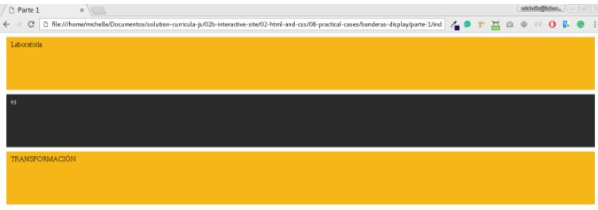

Banderas Display-Parte Uno

1. Autora: Melissa Yauri

2. Objetivo  
El presente trabajo consta en realizar un menu de navegación y cada vez que pase el cursor el menu cambie de color.

3. Herramientas   
 -Html   
 -Javascript  
 -Css

4. Imagen  

